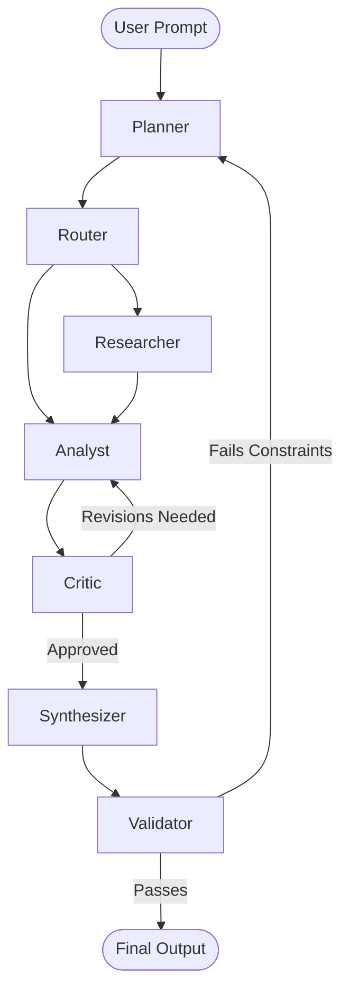

# 🤖 Multi-Agent AI Orchestration Platform

An enterprise-grade, highly resilient multi-agent AI system designed to solve complex, multi-step problems autonomously. Built on a modern tech stack featuring **LangGraph, FastAPI, Next.js, Celery, PostgreSQL, and Redis**.

## 🌟 Overview

The Multi-Agent AI Orchestration platform provides a robust environment where specialized AI agents collaborate to fulfill complex user prompts. Instead of relying on a single, monolithic LLM call, this platform delegates work to specific roles (Planner, Researcher, Analyst, etc.) that can iteratively gather data, review each other's work, and synthesize high-quality output.

## ✨ Key Features

- **Multi-Agent Architecture**: 7 distinct agent personas orchestrated via LangGraph.
- **Real-Time Visualization**: A Next.js frontend with React Flow provides live tracking of agent execution and state changes.
- **State Persistence**: PostgreSQL-backed event sourcing and state checkpointing allow for auditability and workflow resumption.
- **Resilient Tooling**: Built-in circuit breakers and failovers for external APIs (e.g., SearXNG to DuckDuckGo fallback).
- **Asynchronous Execution**: Celery workers handle long-running LLM tasks seamlessly.
- **Observability**: OpenTelemetry integration for distributed tracing and performance monitoring.

## 🏗️ System Architecture

The platform is composed of several decoupled services:

1. **Frontend (Next.js)**: Provides the user interface for submitting tasks and visualizing the agent graph in real time via WebSockets.
2. **API Gateway (FastAPI)**: Serves as the entry point, handling authentication, routing, and WebSocket connections.
3. **Task Queue (Celery + Redis)**: Decouples HTTP requests from long-running agent workflows.
4. **Agent Graph (LangGraph)**: The core intelligence engine where agents operate and pass state.
5. **Database (PostgreSQL)**: Stores users, sessions, task definitions, and event histories.

### Agent Workflow



## 🚀 Quickstart

### Prerequisites
- Docker and Docker Compose
- Node.js 20+ (for local frontend dev)
- Python 3.12+ (for local backend dev)

### Installation

1. **Clone the repository** and configure environment variables:
   ```bash
   cp .env.example .env
   # Edit .env to add your LLM_API_KEY and other configurations
   ```

2. **Start the infrastructure**:
   ```bash
   docker compose up -d --build
   ```

3. **Run database migrations**:
   ```bash
   docker compose exec api alembic upgrade head
   ```

4. **Access the Application**:
   - UI: `http://localhost:3000`
   - API Docs: `http://localhost:8000/docs`
   - SearXNG: `http://localhost:8080`

## 🛠️ Testing & Quality Assurance

To ensure system stability, run the automated test suite within the Docker container:

```bash
docker compose exec api pytest tests/
```

## 📊 Monitoring & Logs

View the combined logs of all services (API, Celery workers, Database, Redis):
```bash
docker compose logs -f
```

## 📈 Evaluation & Metrics
For a detailed breakdown of the system's performance, agent efficacy, and architectural decisions, please refer to the [EVALUATION.md](EVALUATION.md) report.
